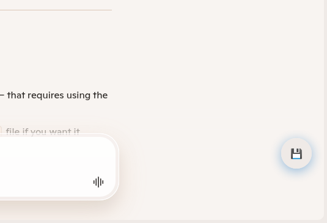

# AI Chat Export Helper

## Overview

**AI Chat Export Helper** is a lightweight browser extension designed for AI enthusiasts and developers alike. Many online AI chat platforms - like Microsoft Copilot - don't natively allow users to download, export, or save their AI conversations. This add-on changes that. With a single click, you can instantly download your AI chat as a **plain text** or **JSON** file, making it perfect for archiving, sharing, or analyzing your AI interactions.  

Whether you're working on AI projects, collecting datasets, or just want to keep a record of your conversations with intelligent agents, this add-on integrates seamlessly into your workflow.

## Features

- Adds a **small, unobtrusive button** at the lower-right corner of Microsoft Copilot. More services planned.
- Export your AI conversations in **plain text** or **JSON format** for easy processing.
- Optimized for **performance**, ensuring it won’t slow down your AI chat experience.
- Perfect for **AI researchers, developers, and data enthusiasts** looking to archive conversations.
- Works with current Copilot AI chat layout, and does not altering its core functionality.

## Why Use This Add-On?

- Never lose an important AI-generated conversation.
- Easily analyze AI chat logs for **machine learning**, **data science**, or personal productivity purposes.
- Streamline your AI workflow by making exports easy.
- Lightweight, free, and **open-source** under a developer-friendly license.

## Installation

1. Install the extension from Mozilla Add-Ons: [AI Chat Export Helper](https://addons.mozilla.org/en/firefox/addon/ai-chat-export-helper/)
2. Enjoy effortless exporting of your AI conversations.

## License

This project is released under the **[GNU GPL v3](https://www.gnu.org/licenses/gpl-3.0.en.html)** license. You are free to use, modify, and distribute it under the same license.

## Developer

Developed by **Micropolis AI Team**. For more AI tools and info visit [Micropolis AI](https://www.micropolis.com/ai)

---

Keywords: AI, Artificial Intelligence, Firefox add-on, Microsoft Copilot, AI chat export, AI conversation download, JSON export, plain text export, machine learning, AI workflow, developer tool.

